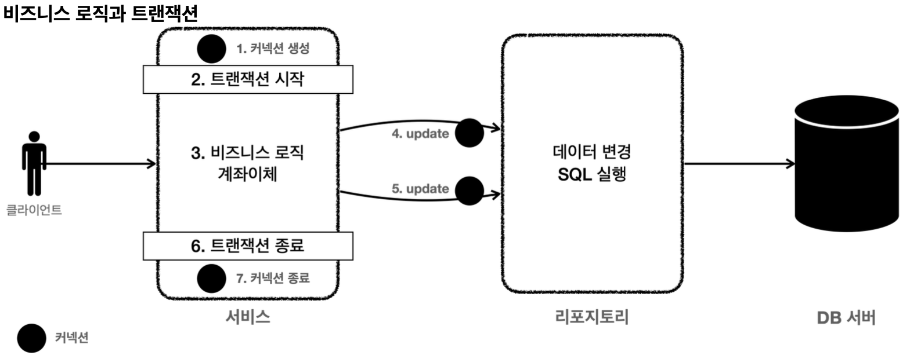
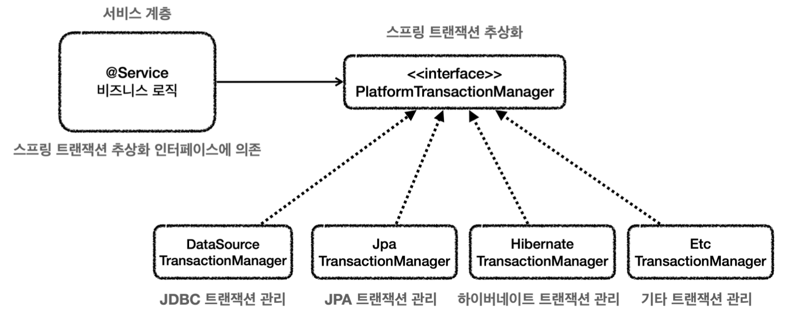
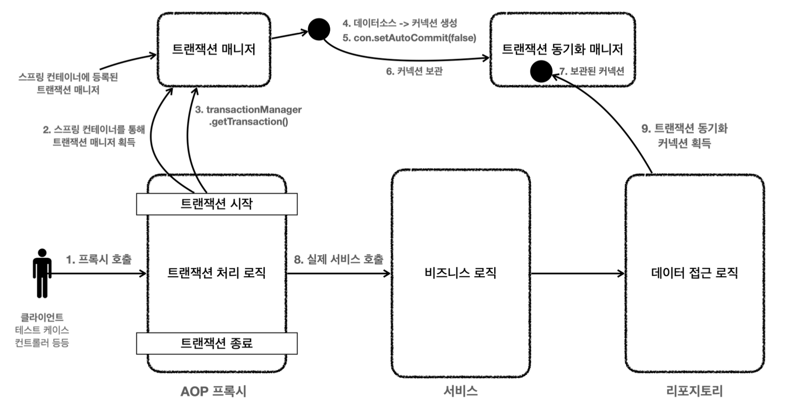

# 스프링 DB 1편 - 데이터 접근 핵심 원리

## JDBC 이해

H2 데이터베이스 설정<br>
External libraies 에서 com.h2database:h2:x.x.xxx 버전 확인하여 설치 추천

JDBC 등장 이유<br>
각 데이터베이스 연결 방법을 구현한 클래스(드라이버) 마다 연결 방법이 달라 JDBC 표준 인터페이스 정의

JDBC 랩핑<br>
오래된 기술인 만큼 사용하는 방법도 복잡하다. SQL Mapper 와 ORM 기술로 한번 랩핑하게되었다.

**커넥션 연결 코드**
```java
public class DBConnectionUtil {
  public static Connection getConnection() {
    try {
      Connection connection = DriverManager.getConnection(URL, USERNAME,PASSWORD);
      log.info("get connection={}, class={}", connection, connection.getClass());
      return connection;
    } catch (SQLException e) {
      throw new IllegalStateException(e);
    }
  }
}

  // DBConnectionUtilTest.java
  @Test
  void connection() {
    Connection connection = DBConnectionUtil.getConnection();
    assertThat(connection).isNotNull();
  }
```

**JDBC 사용하여 Repository 작성**
```java

public class MemberRepositoryV0 {
  public Member save(Member member) throws SQLException {
    String sql = "insert into member(member_id, money) values(?, ?)";
    Connection con = null;
    PreparedStatement pstmt = null;
    try {
      con = getConnection();
      pstmt = con.prepareStatement(sql);
      pstmt.setString(1, member.getMemberId());
      pstmt.setInt(2, member.getMoney());
      pstmt.executeUpdate();
      return member;
    } catch (SQLException e) {
      log.error("db error", e);
      throw e;
    } finally {
      close(con, pstmt, null);
    }
  }

  private void close(Connection con, Statement stmt, ResultSet rs) {
    if (rs != null) {
      try {
        rs.close();
      } catch (SQLException e) {
        log.info("error", e);
      }
    }
    if (stmt != null) {
      // stmt close
    }
    if (con != null) {
      // con close
    }
  }
}
```

findById, update, delete 함수도 작성한다.

**테스트 코드**
```java
class MemberRepositoryV0Test {
  MemberRepositoryV0 repository = new MemberRepositoryV0();
  
  @Test
  void crud() throws SQLException {
    // save
    Member memberV0 = new Member("memberV2", 10000);
    repository.save(memberV0);
    
    // findById
    Member foundMember = repository.findById(memberV0.getMemberId());
    log.info("foundMember : {}", foundMember);
    assertThat(foundMember).isEqualTo(memberV0);
    
    // update: money: 10000 -> 20000
    repository.update(memberV0.getMemberId(), 20000);
    Member updatedMember = repository.findById(memberV0.getMemberId());
    assertThat(updatedMember.getMoney()).isEqualTo(20000);
    
    // delete
    repository.delete(memberV0.getMemberId());
    Assertions.assertThatThrownBy(() -> repository.findById(memberV0.getMemberId()))
          .isInstanceOf(NoSuchElementException.class);
  }
}
```

JDBC가 제공하는 `DriverManager` 는 라이브러리에 등록된 DB 드라이버들을 관리하고, 커넥션을 획득하는 기능을 제공한다.

## 커넥션풀과 데이터소스 이해

데이터베이스 커넥션 획득<br>
- DB드라이버가 커넥션 조회 
- DB드라이버가 DB와 TCP연결 후 인증정보 전달
- DB는 인증완료 후 내부에 세션 생성, 커넥션 연결 응답
- DB드라이버는 커넥션 객체를 생성해 클라리언트에 반환

오래걸리기 때문에 커넥션을 미리 생성해두는 커넥션 풀 방식<br>
시작하는 시점에서 커넥션을 미리 확보해둔다 기본값은 보통 10<br>
대표적인 오픈소스는 `commons-dbcp2`,`tomcat-jdbc pool`,`HikariCP(default)`

`DriverManager.getConnection()` 을 사용하다가 `HikariCP`에서 커넥션을 얻으려면 커넥션을 얻는 코드를 변경해야한다. 자바에선 이런 문제를 해결하기 위해 커넥션을 얻는 방법을 추상화 한 `DataSource`가 있다. 핵심 기능은 커넥션 조회 하나.

DriverManager 는 DataSource 를 사용하지 않고 직접 커넥션을 얻는 방법이지만 스프링은 공통적인 추상화를 위해 DriverManagerDataSource 라는 DataSource 구현체를 만들어두었다.

**DataSource 사용 코드**
```java
public class ConnectionTest {
  @Test
    void driverManager() throws SQLException {
    Connection conn1 = DriverManager.getConnection(URL, USERNAME, PASSWORD);
    Connection conn2 = DriverManager.getConnection(URL, USERNAME, PASSWORD);
    log.info("conn1: {}, class:{}", conn1, conn1.getClass());
    log.info("conn2: {}, class:{}", conn2, conn2.getClass());
  }
  
  @Test
    void dataSourceDriverManager() throws SQLException {
    //DriverManagerDataSource - 항상 새로운 커넥션을 획득
    DataSource dataSource = new DriverManagerDataSource(URL, USERNAME, PASSWORD);
    useDataSource(dataSource);
  }
  
  @Test
  void dataSourceConnectionPool() throws SQLException, InterruptedException {
    // 커넥션 풀링
    HikariDataSource dataSource = new HikariDataSource();
    dataSource.setConnectionTimeout(10000);
    dataSource.setJdbcUrl(URL);
    dataSource.setUsername(USERNAME);
    dataSource.setPassword(PASSWORD);
    dataSource.setMaximumPoolSize(10);
    dataSource.setPoolName("CustomPool");
    
    useDataSource(dataSource);
    Thread.sleep(2000);
  }
  
  private void useDataSource(DataSource dataSource) throws SQLException {
    Connection conn1 = dataSource.getConnection();
    Connection conn2 = dataSource.getConnection();
    //Connection conn3 = dataSource.getConnection();
    //Connection conn4 = dataSource.getConnection();
    log.info("conn1: {}, class:{}", conn1, conn1.getClass());
    log.info("conn2: {}, class:{}", conn2, conn2.getClass());
  }
}
```

**DatsSoruce 사용하여 Repository 작성**
```java
public class MemberRepositoryV1 {
  private final DataSource dataSource;

  public MemberRepositoryV1(DataSource dataSource) {
    this.dataSource = dataSource;
  }

  public Member save(Member member) throws SQLException {
    String sql = "insert into member(member_id, money) values (?, ?)";
    Connection conn = null;
    PreparedStatement pstmt = null;
  
    try {
      conn = getConnection();
      pstmt = conn.prepareStatement(sql);
      pstmt.setString(1, member.getMemberId());
      pstmt.setInt(2, member.getMoney());
      pstmt.executeUpdate();
      return member;
    } catch (SQLException e) {
      log.error("db error", e);
      throw e;
    } finally {
      close(conn, pstmt, null);
    }
  }

  //findById()
  //update()
  //delete()

  private void close(Connection conn, Statement stmt, ResultSet rs) {
    JdbcUtils.closeResultSet(rs);
    JdbcUtils.closeStatement(stmt);
    JdbcUtils.closeConnection(conn); // connection pool 은 pool 에 반환한다.
  }

  private Connection getConnection() throws SQLException {
    Connection conn = dataSource.getConnection();
    log.info("get connection={}, class={}", conn, conn.getClass());;
    return conn;
  }
}
```

`DataSource`를 의존관계로 외부에서 주입받아 사용한다. 직접만든 `DBConnectionUtil`를 사용하지 않고 표준 인터페이스이기 때문에 `DriverManagerDataSource`,`HikariDataSource`등의 구현체를 변경해도 문제 없다.<br>
`JdbcUtils`사용하여 여러 리소스들을 close 할 때 편하게 종료할 수 있다.

**V1 테스트코드 변경사항**
```java
class MemberRepositoryV1Test {
  MemberRepositoryV1 repository;

  @BeforeEach
  void beforeEach() {
    // 기본 DriverManager - 항상 새로운 커넥션을 획득
    //DriverManagerDataSource dataSource = new DriverManagerDataSource(URL, USERNAME, PASSWORD);
    // 커넥션 풀링
    HikariDataSource dataSource = new HikariDataSource();
    dataSource.setJdbcUrl(URL);
    dataSource.setUsername(USERNAME);
    dataSource.setPassword(PASSWORD);
  
    repository = new MemberRepositoryV1(dataSource);
  }

  //crud()
}

```
Repository 를 만들 때 DataSource 를 만들어 DI 한다.


## 트랜잭션 이해
트랜잭션은 ACID: 원자성(Atomicity),일관성(Consistency),격리성(Isolation),지속성(Durability)을 보장해야 한다.

**트랜잭션 격리 수준 - Isolation level**
- READ UNCOMMITED(커밋되지 않은 읽기)
- READ COMMITTED(커밋된 읽기)
- REPEATABLE READ(반복 가능한 읽기)
- SERIALIZABLE(직렬화 가능)
<br>

**데이터베이스 서버 연결 구조와 DB 세션에 대해**
- 사용자가 서버 어플리케이션 혹은 DB툴로 클라이언트가 되어 DB 서버에 접근할 경우 DB 서버와 커넥션을 맺게 된다. 이 때 DB는 내부에 세션을 만든다. 해당 커넥션은 이 세션을 통해 실행된다.
- 세션은 트랜잭션을 시작하고 커밋 또는 롤백으로 트랜잭션을 종료한다. 이후 새로운 트랜잭션을 다시 시작할 수 있다.
- 사용자가 커넥션을 닫거나, DB가 세션을 강제로 종료하면 세션은 종료된다.

### 실습
이후 H2 DB 에서 `set autocommit false;`를 사용하여 세션을 2개 만들어 커밋전에 다른 세션에 데이터가 적용되지 않는 실습을 함.<br>
보통 자동 커밋 모드가 기본으로 설정된 경우가 많기 때문에, **수동 커밋 모드로 설정하는 것을 트랜잭션을 시작**한다고 표현할 수 있다.


**트랜잭션 없이 계좌이체 ServiceV1 로직 작성**
```java
@RequiredArgsConstructor
public class MemberServiceV1 {
  private final MemberRepositoryV1 memberRepository;
  
  public void accountTransfer(String fromId, String toId, int money) throws SQLException {
    Member fromMember = memberRepository.findById(fromId);
    Member toMember = memberRepository.findById(toId);
    
    memberRepository.update(fromId, fromMember.getMoney() - money);
    testValidation(toMember);
    memberRepository.update(toId, toMember.getMoney() + money);
  }
  
  private static void testValidation(Member toMember) {
    if (toMember.getMemberId().equals("ex")) {
      throw new IllegalStateException("이체중 예외 발생");
    }
  }
}

//MemberServiceV1Test.java
class MemberServiceV1Test {
  public static final String MEMBER_A = "memberA";
  public static final String MEMBER_B = "memberB";
  public static final String MEMBER_EX = "ex";

  private MemberRepositoryV1 memberRepository;
  private MemberServiceV1 memberService;

  @BeforeEach
  void before() {
    DriverManagerDataSource dataSource = new DriverManagerDataSource(URL, USERNAME, PASSWORD);
    memberRepository = new MemberRepositoryV1(dataSource);
    memberService = new MemberServiceV1(memberRepository);
  }

  @AfterEach()
  void after() throws SQLException {
    memberRepository.delete(MEMBER_A);
    memberRepository.delete(MEMBER_B);
    memberRepository.delete(MEMBER_EX);
  }

  @Test
  @DisplayName("정상 이체")
  void accountTransfer() throws SQLException {/* 생략 */}

  @Test 
  @DisplayName("이체중 예외 발생")
  void accountTransferEx() throws SQLException {
  //given
    Member memberA = new Member(MEMBER_A, 10000);
    Member memberEx = new Member(MEMBER_EX, 10000);
    memberRepository.save(memberA);
    memberRepository.save(memberEx);

    //when
    assertThatThrownBy(() -> {
      memberService.accountTransfer(memberA.getMemberId(), memberEx.getMemberId(), 2000);
    }).isInstanceOf(IllegalStateException.class);

    //then
    assertThat(memberRepository.findById(MEMBER_A).getMoney()).isEqualTo(8000);
    assertThat(memberRepository.findById(MEMBER_EX).getMoney()).isEqualTo(10000);
  }
}
```

이체중 예외 발생 테스트에서 `MEMBER_A`의 금액은 8000으로 2000원 감소되게 되지만 `MEMBER_EX`의 금액은 12000원이 아닌 10000으로 이체가 되지 않았다. `MEMBER_A`의 돈만 2000원이 날아갔다.

트랜잭션을 적용하여 V1의 문제를 해결해보자. 트랜잭션을 어디에서 시작하고 어디에서 commit으로 트랜잭션을 종료 해야할까?
<br><br>


**트랜잭션 적용한 RepositoryV2, ServiceV2**
```java
//MemberRepositoryV2.java
  public Member findById(final Connection conn, String memberId) throws SQLException {
    String sql = "select * from member where member_id = ?";
    PreparedStatement pstmt = null;
    ResultSet rs = null;
    
    try {
      pstmt = conn.prepareStatement(sql);
      pstmt.setString(1, memberId);
      rs = pstmt.executeQuery();
      if (rs.next()) {
        Member member = new Member();
        member.setMemberId(rs.getString("member_id"));
        member.setMoney(rs.getInt("money"));
        return member;
      } else {
        throw new NoSuchElementException("Member not found memberId : " + memberId);
      }
    } catch (SQLException e) {
      log.error("db error", e);
      throw e;
    } finally {
      // 커넥션은 여기서 닫지 않는다!
      JdbcUtils.closeResultSet(rs);
      JdbcUtils.closeStatement(pstmt);
    }
  }

//MemberServiceV2.java
@RequiredArgsConstructor
public class MemberServiceV2 {
  private final DataSource dataSource;
  private final MemberRepositoryV2 memberRepository;
  
  public void accountTransfer(String fromId, String toId, int money) throws SQLException {
    Connection conn = dataSource.getConnection();
    try {
      conn.setAutoCommit(false); // 트랜잭션 시작
      bizLogic(conn, toId, fromId, money);
      conn.commit(); // 성공 시 커밋
    } catch (Exception e) {
      conn.rollback(); // 실패 시 롤백
      throw new IllegalStateException(e);
    } finally {
      release(conn);
    }
  }
  
  private void bizLogic(Connection conn, String toId, String fromId, int money) throws SQLException {
    // 비즈니스 로직
    // findById 와 update 메서드 시 conn 파라미터 전달
  }
  
  private static void testValidation(Member toMember) {
    if (toMember.getMemberId().equals("ex")) {
      throw new IllegalStateException("이체중 예외 발생");
    }
  }
  
  private static void release(Connection conn) {
    if (conn != null) {
      try {
        conn.setAutoCommit(true); // 커넥션 풀 고려
        conn.close();
      } catch (Exception e) {
        log.info("error", e);
      }
    }
  }

}
```

개미친 코드 탄생<br>
커넥션 유지가 필요하기에 repository 에서 커넥션을 열거나 닫지 않고 서비스에서 처리하여 파라미터로 넘겨준다.


## 스프링과 문제 해결 - 트랜잭션
1. 지금 구현한 트랜잭션의 문제점
- 1. JDBC 누수 문제: 서비스 계층이 JDBC에 의존하여 비즈니스 로직과 트랜잭션 로직이 섞임.
- 2. 반복 코드: try-catch-finally, 커넥션 열고닫기 같은 트랜잭션 처리 코드 반복.
- 3. 예외 누수 문제: 데이터 접근 계층에서 발생한 JDBC 예외가 서비스 계층으로 전파.
- 4. 기술 변경의 어려움: JDBC에서 JPA로 변경 시 서비스 계층도 수정이 필요.(누수 문제와 연관)

2. 스프링의 문제 해결 접근
- 1. 트랜잭션 추상화: PlatformTransactionManager 인터페이스로 JDBC와 JPA 같은 다양한 기술 지원.
- 2. 트랜잭션 동기화: TransactionSynchronizationManager를 사용해 같은 커넥션을 유지.
- 3. 트랜잭션 템플릿: TransactionTemplate을 사용해 트랜잭션 관리 코드를 단순화.
- 4. AOP 기반 트랜잭션: @Transactional을 활용한 선언적 트랜잭션 관리로 트랜잭션 관련 코드를 서베스에서 제거.(템플릿보다 발전)
<br>(예외 누수는 아직 해결이 안됨)

3. 각 기술의 세부 내용
### 트랜잭션 추상화
**PlatformTransactionManager는 트랜잭션 추상화를 제공.**<br>
**기술에 따라 DataSourceTransactionManager, JpaTransactionManager 등 구현체 사용.**

트랜잭션은 원자적 단위의 비즈니스 로직을 처리하기 위해 사용한다.<br>
구현기술마다 트랜잭션을 사용하는 코드가 다른다
```java
// JDBC 트랜잭션 코드 예시
Connection con = dataSource.getConnection();
con.setAutoCommit(false);
// TODO: bizLogic
con.commit(); //con.rollback();

// JPA 트랜잭션 코드 예시
EntityManagerFactory emf = Persistence.createEntityManagerFactory("jpabook");
EntityManager em = emf.createEntityManager(); //엔티티 매니저 생성
EntityTransaction tx = em.getTransaction(); //트랜잭션 기능 획득
tx.begin();
// TODO: bizLogic
tx.commit(); //tx.rollback();
```

트랜잭션을 사용하는 코드는 데이터 접근 기술마다 다르다. 만약 JDBC 기술을 사용하고, JDBC 트랜 잭션에 의존하다가 JPA 기술로 변경하게 되면 서비스 계층의 트랜잭션을 처리하는 코드도 모두 함께 변경해야 한다.<br>
이런 문제를 해결하려면 트랜잭션 기능을 추상화하면 된다. 단순하게 트랜잭션 시작, 로직 종료 후 커밋 or 롤백 을 수행하는 인터페이스를 만든다.
```java
public interface TxManager {
  begin();
  commit();
  rollback();
}
```

그리고 JdbcTxManager 와 JpaTxManager 를 만들어서 인터페이스 규약에 맞는 구현체를 각각의 기술로 만들어서 제공하면 된다. 그렇게되면 서비스는 특정 트랜잭션 기술에 직접 의존하는 것이 아니라, `TxManager` 라는 추상화된 인터페이스에 의존한다. 이제 원하는 구현체를 DI를 통해서 주입하면 된다. 예를 들어서 JDBC 트랜잭션 기능이 필요하면
`JdbcTxManager` 를 서비스에 주입하고, JPA 트랜잭션 기능으로 변경해야 하면 `JpaTxManager` 를 주입하면 된다.

스프링은 이런 고민을 이미 해결했다.

> ※스프링 5.3부터 JDBC 트랜잭션 구현체는 `JdbcTransactionManager`를 제공한다. `DataSourceTransactionManager`와 기능 차이는 크지 않으므로 같은 것으로 이해하면 된다.

### 트랜잭션 동기화
**스프링은 트랜잭션 동기화 매니저를 제공한다. 트랜잭션 매니저가 데이터소스로 커넥션을 만들고 트랜잭션을 시작하면 커넥션을 트랜잭션 동기화 매니저에 보관한다. 동기화 매니저는 ThreadLocal 을 통해 커넥션을 동기화 한다.**

스프링이 제공하는 트랜잭션 매니저는 크게 2가지 역할을 한다.
- 트랜잭션 추상화 (지금까지 설명)
- 리소스 동기화
  - 트랜잭션을 유지하려면 트랜잭션의 시작부터 끝까지 같은 데이터베이스 커넥션을 유지해아한다. 결국 같은 커넥션을 동기화(맞추어 사용)하기 위해서 이전에는 파라미터로 커넥션을 전달하는 방법을 사용했다. 파라미터로 커넥션을 전달하는 방법은 코드가 지저분해지는 것은 물론이고, 커넥션을 넘기는 메서드와 넘기지 않는 메 서드를 중복해서 만들어야 하는 등 여러가지 단점들이 많다.


```java
//MemberRepositoryV3.java
  public Member findById(String memberId) throws SQLException {
    String sql = "select * from member where member_id = ?";
    Connection conn = null;
    PreparedStatement pstmt = null;
    ResultSet rs = null;
    
    try {
      conn = getConnection();
      pstmt = conn.prepareStatement(sql);
      pstmt.setString(1, memberId);
      rs = pstmt.executeQuery();
      if (rs.next()) {
        Member member = new Member();
        member.setMemberId(rs.getString("member_id"));
        member.setMoney(rs.getInt("money"));
        return member;
      } else {
        throw new NoSuchElementException("Member not found memberId : " + memberId);
      }
    } catch (SQLException e) {
      log.error("db error", e);
      throw e;
    } finally {
      close(conn, pstmt, rs);
    }
  }

  private void close(Connection conn, Statement stmt, ResultSet rs) {
    JdbcUtils.closeResultSet(rs);
    JdbcUtils.closeStatement(stmt);
    // 주의! 트랜잭션 동기화를 사용하려면 DataSourceUtils 를 사용해야한다.
    DataSourceUtils.releaseConnection(conn, dataSource);
    // 트랜잭션 동기화 매니저에서 가져와 사용한 커넥션인지 확인한다. 맞으면 종료하지 않고 반환,
    // 아니면 내가 스스로 생성한 커넥션인것이니 종료한다.
  }

  private Connection getConnection() throws SQLException {
    // 주의! 트랜잭션 동기화를 사용하려면 DataSourceUtils 를 사용해야한다.
    Connection conn = DataSourceUtils.getConnection(dataSource);
    // 트랜잭션 동기화 매니저에 커넥션이 있는지 확인한다. 있으면 그걸 사용하고 없으면 새로 만든다.
    log.info("get connection={}, class={}", conn, conn.getClass());;
    return conn;
  }


//MemberServiceV3_1.java
@RequiredArgsConstructor
public class MemberServiceV3_1 {
  private final PlatformTransactionManager transactionManager;
  private final MemberRepositoryV3 memberRepository;
  
  public void accountTransfer(String fromId, String toId, int money) throws SQLException {
    // 트랜잭션 시작
    TransactionStatus status = transactionManager.getTransaction(new DefaultTransactionDefinition());
    try {
      bizLogic(toId, fromId, money);
      transactionManager.commit(status); // 성공 시 커밋
    } catch (Exception e) {
      transactionManager.rollback(status); // 실패 시 롤백
      throw new IllegalStateException(e);
    }
    // release 는 자동으로 이루어짐
  }
  
  private void bizLogic(String toId, String fromId, int money) throws SQLException {
    // 비즈니스 로직
  }
  
  private static void testValidation(/**/) {/**/};
  
  // void release() 삭제
}

//MemberServiceV3_1Test.java
  @BeforeEach
  void before() {
    DriverManagerDataSource dataSource = new DriverManagerDataSource(URL, USERNAME, PASSWORD);
    memberRepository = new MemberRepositoryV3(dataSource);
    PlatformTransactionManager transactionManager = new DataSourceTransactionManager(dataSource);
    memberService = new MemberServiceV3_1(transactionManager, memberRepository);
  }


```
MemberRepositoryV3 에서 커넥션을 파라미터로 전달하는 부분이 삭제되었다. 커넥션을 가져오거나 닫는 함수에서 DataSourceUtils 를 사용한다.<br>
MemberServiceV3_1 에서 DataSourceTransactionManager 를 주입받도록 한다.(JDBC 용)


### 트랜잭션 템플릿
**중복된 트랜잭션 관리 코드를 제거.**<br>
**execute() 또는 executeWithoutResult() 메서드로 비즈니스 로직 실행.**<br>
**비즈니스 로직은 람다식으로 간결히 표현 가능.**

```java
public class TransactionTemplate {
  private PlatformTransactionManager transactionManager;
  public <T> T execute(TransactionCallback<T> action){..} // 응답 값 있을 때
  void executeWithoutResult(Consumer<TransactionStatus> action){..} // 응답 값 없을 때
}

//MemberServiceV3_2.java
public class MemberServiceV3_2 {
  private final TransactionTemplate txTemplate;
  private final MemberRepositoryV3 memberRepository;

  public MemberServiceV3_2(PlatformTransactionManager transactionManager, MemberRepositoryV3 memberRepository) {
    this.txTemplate = new TransactionTemplate(transactionManager);
    this.memberRepository = memberRepository;
  }
  
  public void accountTransfer(String fromId, String toId, int money) {
    txTemplate.executeWithoutResult((status) -> {
      try {
        bizLogic(toId, fromId, money);
      } catch (SQLException e) {
        throw new IllegalStateException(e);
      }
    });
  }

  private void bizLogic(String toId, String fromId, int money) throws SQLException {
    // 비즈니스 로직
    // findById 와 update 메서드 사용
  }
  
  private static void testValidation(/**/) {/**/};
}


//MemberServiceV3_2Test.java
  @BeforeEach
  void before() {
    DriverManagerDataSource dataSource = new DriverManagerDataSource(URL, USERNAME, PASSWORD);
    memberRepository = new MemberRepositoryV3(dataSource);
    PlatformTransactionManager transactionManager = new DataSourceTransactionManager(dataSource);
    memberService = new MemberServiceV3_2(transactionManager, memberRepository);
  }

```

트랜잭션 템플릿 덕분에 트랜잭션을 처리하는 반복 코드는 해결할 수 있었다. 하지만 서비스 계층에 순수한 비즈 니스 로직만 남긴다는 목표는 아직 달성하지 못했다.

### AOP 기반 트랜잭션
**@Transactional로 간단히 트랜잭션 프록시 적용.**<br>
**AOP를 통해 비즈니스 로직에서 트랜잭션 관련 코드를 분리.**<br>
**서비스 계층은 순수한 비즈니스 로직만 포함.**<br>
**멀티스레드 안전성을 보장.**<br>

개발자는 트랜잭션 처리가 필요한 곳에 `@Transactional` 애노테이션만 붙여주면 된다. 스프링의 트랜잭션 AOP는 이 애노테이션을 인식해서 트랜잭션 프록시를 적용해준다.
스프링 AOP를 적용하려면 어드바이저, 포인트컷, 어드바이스가 필요하다. 스프링은 트랜잭션 AOP 처리를 위해 다음 클래스를 제공한다. 스프링 부트를 사용하면 해당 빈들은 스프링 컨테이너에 자동으로 등록된다.
>어드바이저: `BeanFactoryTransactionAttributeSourceAdvisor`<br>
>포인트컷: `TransactionAttributeSourcePointcut`<br>
>어드바이스: `TransactionInterceptor`

```java
//MemberServiceV3_3.java
@Slf4j
public class MemberServiceV3_3 {
    private final MemberRepositoryV3 memberRepository;

    public MemberServiceV3_3(MemberRepositoryV3 memberRepository) {
        this.memberRepository = memberRepository;
    }

    @Transactional
    public void accountTransfer(String fromId, String toId, int money) throws SQLException {
        bizLogic(toId, fromId, money);
    }
    // 생략


//MemberServiceV3_2Test.java
@SpringBootTest
class MemberServiceV3_3Test {
  // MEMBER_A,B,EX 선언

  @Autowired
  private MemberRepositoryV3 memberRepository;
  @Autowired
  private MemberServiceV3_3 memberService;

  @TestConfiguration
  static class TestContextConfiguration {
      @Bean
      DataSource dataSource() {
          return new DriverManagerDataSource(URL, USERNAME, PASSWORD);
      }
      @Bean
      PlatformTransactionManager transactionManager() {
          return new DataSourceTransactionManager(dataSource());
      }
      @Bean
      MemberRepositoryV3 memberRepository() {
          return new MemberRepositoryV3(dataSource());
      }
      @Bean
      MemberServiceV3_3 memberService() {
          return new MemberServiceV3_3(memberRepository());
      }
  }

  @AfterEach()
  // void after

  @Test
  void AopCheck() {
      log.info("memberService class={}", memberService.getClass());
      log.info("memberRepository class={}", memberRepository.getClass());
      assertThat(AopUtils.isAopProxy(memberService)).isTrue();
      assertThat(AopUtils.isAopProxy(memberRepository)).isFalse();
  }
  // 생략
```

서비스에 순수 비즈니스 로직만 남기고, 트랜잭션 관련 코드는 모두 제거했다.<br>
`@Transactional` 애노테이션은 메서드에 붙여도 되고, 클래스에 붙여도 된다. 클래스에 붙이면 외부에서 호출 가능한 `public` 메서드가 AOP 적용 대상이 된다

`@SpringBootTest` : 스프링 AOP를 적용하려면 스프링 컨테이너가 필요하다. 이 애노테이션이 있으면 테스트 시 스프링 부트를 통해 스프링 컨테이너를 생성한다. 그리고 테스트에서 `@Autowired` 등을 통해 스프링 컨테이 너가 관리하는 빈들을 사용할 수 있다.<br>
`@TestConfiguration` : 테스트 안에서 내부 설정 클래스를 만들어서 사용하면서 이 에노테이션을 붙이면, 스 프링 부트가 자동으로 만들어주는 빈들에 추가로 필요한 스프링 빈들을 등록하고 테스트를 수행할 수 있다.<br>
`DataSource` 스프링에서 기본으로 사용할 데이터소스를 스프링 빈으로 등록한다. 추가로 트랜잭션 매니저에서도 사용한다.<br>
`DataSourceTransactionManager` 트랜잭션 매니저를 스프링 빈으로 등록한다.<br>
스프링이 제공하는 트랜잭션 AOP는 스프링 빈에 등록된 트랜잭션 매니저를 찾아서 사용하기 때문에 트랜잭션 매니저를 스프링 빈으로 등록해두어야 한다.

### 트랜잭션 AOP 적용 전체 흐름


### 스프링 부트의 자동 리소스 등록
application.properties에 설정만 추가하면 데이터소스와 적절한 트랜잭션 매니저 자동 등록. 기본으로 HikariDataSource를 사용.

application.properties 에 `spring.datasource.url=`,`spring.datasource.username=`,`spring.datasource.password=` 등록 시 Service Test code 에서 간단히 데이터 소스를 주입받을 수 있음

```java

/**
 * 트랜잭션 - DataSource, transactionManager 자동 등록
 */
@SpringBootTest
class MemberServiceV3_4Test {
  
  @TestConfiguration
  static class TestConfig {
    private final DataSource dataSource;
    
    public TestConfig(DataSource dataSource) {
      this.dataSource = dataSource;
    }

    @Bean
    MemberRepositoryV3 memberRepositoryV3() {
      return new MemberRepositoryV3(dataSource);
    }

    @Bean
    MemberServiceV3_3 memberServiceV3_3() {
      return new MemberServiceV3_3(memberRepositoryV3());
    }
  // 생략
}
```

## 자바 예외 이해

## 스프링과 문제 해결 - 예외 처리, 반복


